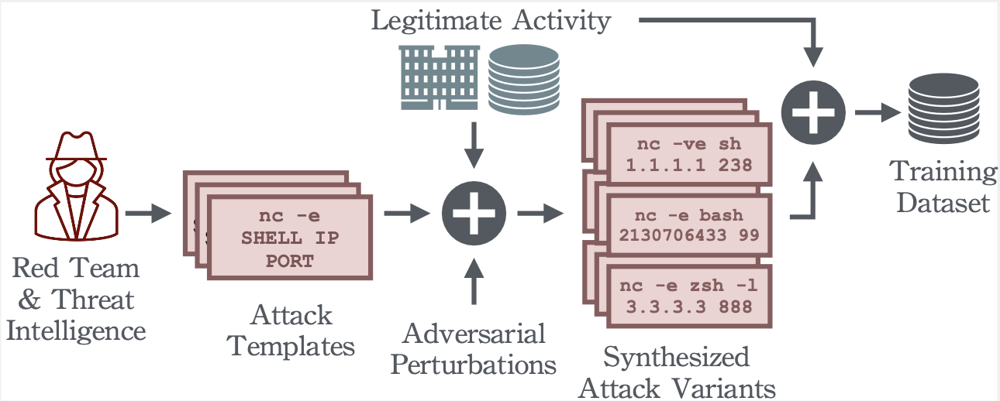

<div align="center">

# QuasarNix: Adversarially Robust Living-off-the-Land Reverse-Shell Detection

*Dmitrijs Trizna · Luca Demetrio · Battista Biggio · Fabio Roli*

[](https://dl.acm.org/doi/10.1145/3807450)
[](https://arxiv.org/abs/2402.18329)
[](https://huggingface.co/datasets/dtrizna/QuasarNix)
[](https://huggingface.co/dtrizna/QuasarNix)



</div>

---

## Overview

Linux *living-off-the-land* (LOTL) reverse shells abuse legitimate binaries (`bash`, `python`, `nc`, …) to establish covert outbound connections, making signature-based detection unreliable against novel variants and evasion attempts. QuasarNix addresses two open gaps in the field:

1. **No public ML-based SIEM detectors** — we release the first production-ready, openly licensed ML models for LOTL reverse-shell detection.
2. **Adversarial fragility** — we evaluate models under evasion and poisoning attacks, and provide adversarially-trained checkpoints that survive all tested attacks.

The framework synthesises a 1M-command training corpus from 34 reverse-shell templates and evaluates 14 model architectures at an operating point of **FPR = 10⁻⁶** — reflecting real SIEM alert fatigue constraints.

---

## Key Results

Performance on the held-out test set across baseline heuristics and QuasarNix architectures. TPR is reported as mean ± std across ten independent training runs at **FPR = 10⁻⁶**. Bold marks the best result; asterisk (*) highlights models discussed in the paper.

### Baselines

| Architecture | Params | TPR @ FPR=10⁻⁶ | F1 | Accuracy | AUC | Training |
|---|---|---|---|---|---|---|
| Signatures (Sigma) | 184 | 3.37% | 6.52% | 51.68% | 51.68% | N/A |
| One-Class SVM (on legit) | 1K | 0.00% | 82.87% | 79.33% | 79.33% | 10s |
| One-Class SVM (on malicious) | 1K | 0.00% | 40.14% | 25.20% | 25.20% | 10s |
| 1D-CNN (non-aug., imbalanced) | 1K | 0.00% | 80.29% | 77.91% | 87.44%* | 15m |
| 1D-CNN (non-aug., balanced) | 1K | 0.06% | 82.38% | 79.33% | 88.12%* | 29m |
| SLP (non-aug.) | 1K | 0.00% | 0.00% | 50.00% | 91.58% | 1h 12m |

### QuasarNix — Tabular Models (One-Hot Encoding)

| Architecture | Params | TPR @ FPR=10⁻⁶ | F1 | Accuracy | AUC | Training |
|---|---|---|---|---|---|---|
| Random Forest | 1K | 42.23 ± 6.27% | 96.07% | 96.21% | 99.84% | 18s |
| **GBDT (XGBoost)** | **1K** | **60.20 ± 8.22%** | 89.92% | 90.84% | **99.89%** | **14s** |
| MLP (No Embedding) | 264K | 54.16 ± 2.14%* | 94.00% | 94.34% | 99.80% | 18m |

### QuasarNix — Sequential Models (Token Embeddings)

| Architecture | Params | TPR @ FPR=10⁻⁶ | F1 | Accuracy | AUC | Training |
|---|---|---|---|---|---|---|
| MLP (Embedding) | 297K | 10.76 ± 17.32% | 67.70% | 75.60% | 89.15% | 18m |
| LSTM | 318K | 21.52 ± 23.66% | 64.16% | 74.05% | 99.75% | 24m |
| 1D-CNN | 301K | 46.42 ± 32.67%* | 85.97% | 88.20% | 99.99% | 29m |
| 1D-CNN + LSTM | 316K | 20.48 ± 22.08% | 58.92% | 71.06% | 98.21% | 29m |
| 1D-CNN + LSTM + Attention | 402K | 17.19 ± 22.59% | 62.53% | 73.08% | 98.46% | 26m |
| Transformer (Mean Pooling) | 335K | 0.00 ± 0.00% | 83.39% | 86.07% | 98.78% | 1h 18m |
| Transformer (CLS Token) | 335K | 0.00 ± 0.00% | 78.55%* | 82.67% | 99.38% | 1h 30m |
| Transformer (Attn. Pooling) | 335K | 0.00 ± 0.00% | 87.82% | 89.41% | 98.85% | 1h 24m |

> **Takeaway:** GBDT achieves **60% TPR at FPR = 10⁻⁶** — 18× higher than signatures (3.37%) — while training in 14 seconds on commodity hardware.

---

## Adversarial Robustness

### Shell Escape Perturbations

The table below catalogs Linux shell escape techniques from the attacker's toolkit. The third column indicates whether the technique survives `auditd` kernel telemetry normalization — only the four **bold** entries produce a distinct `EXECVE` record and constitute the true attack surface.

| Manipulation | Functional Example | Preserved by auditd |
|---|---|---|
| `'` | `ba's'h -i` | No |
| `"` | `ba"s"h -i` | No |
| `\` | `ba\s\h -i` | No |
| `$@` | `ba$@sh -i` | No |
| `[char]` | `ba[s]h -i` | No |
| `{form}` | `{bash,-i}` | No |
| IFS variable | `bash${IFS}-i` | No |
| Empty variable | `bas${u}h -i` | No |
| Fake command | `bas$(u)h -i` | No |
| Base64 | `echo c2ggLWk= \| base64 -d \| sh` | No |
| Hex | `echo \x73\x68 \x20\x2d\x69 \| sh` | No |
| **Flag tampering** | **`bash -x -li`** | **Yes** |
| **Decimal IP** | **`ping 2130706433`** | **Yes** |
| **Binary rename** | **`cp bash a; a -i`** | **Yes** |
| **Futile code** | **`mkfifo a; id; cat a`** | **Yes** |

> Only **4 of 15** techniques survive kernel-level normalization and are used as the adversarial attack space.

### Evasion & Adversarial Training

Three attack families are evaluated — *benign content injection*, *shell escape perturbations*, and a *hybrid* of both:

- **Benign content injection** devastates all neural models; GBDT maintains ≥93% accuracy due to its feature-importance weighting.
- **Shell escape perturbations** reduce GBDT and CNN to 0% accuracy at maximum perturbation budget without defenses.
- **Adversarial training** renders all three attack types ineffective across every evaluated architecture.

---

## Poisoning Robustness

Beyond inference-time evasion, we evaluate training-time attacks:

**Label-flipping pollution** (0–20% of training labels flipped): models degrade gracefully; GBDT shows inherent resistance through ensemble voting, remaining functional at high pollution ratios.

**Backdoor attack** (0.01–1% poison ratio, 2–10 token triggers): short triggers (2–4 tokens) fail to install reliable backdoors due to their prevalence in benign traffic. Optimal backdoor installation requires 6–10 token triggers at ≥0.03% poison ratio.

> **Takeaway:** Poisoning attacks require substantial, statistically detectable data injection to succeed. GBDT's ensemble mechanism provides inherent robustness at no adversarial-training cost.

---

## Industry Validation

After this work was released, Google published a conceptually aligned production system at CAMLIS 2025 ([arXiv:2512.08802](https://arxiv.org/abs/2512.08802)): a two-stage YARA + ML pipeline deployed across tens of thousands of systems, processing up to **250 billion events per day**. That system independently validates the hybrid ML-for-SIEM-detection paradigm and the active-learning feedback loop proposed here, demonstrating its viability at industrial scale.

---

## Dataset & Pre-trained Models

| Resource | Link | Details |
|---|---|---|
| Dataset | [dtrizna/QuasarNix](https://huggingface.co/datasets/dtrizna/QuasarNix) | 1,003,122 commands · train 533k / test 470k · Apache-2.0 |
| Pre-trained Models | [dtrizna/QuasarNix](https://huggingface.co/dtrizna/QuasarNix) | GBDT, Random Forest, MLP, 1D-CNN, … |

```python
from datasets import load_dataset
ds = load_dataset("dtrizna/QuasarNix")
```

---

## Repository Layout

```
src/
  augmentation.py       rule-based and generative data synthesis
  evasion.py            white-box / black-box adversarial attacks
  models.py             model definitions (CNN, LSTM, Transformer, XGBoost, …)
  preprocessors.py      tokenisers and feature builders
  scoring.py            evaluation metrics at fixed FPR

experiments/
  ablation_*.py         ablation studies (tokenizer, vocab size, embedding)
  adversarial_*.py      attack and adversarial-training pipelines
  train_release_models.py  end-to-end training script
  logs_*/               TensorBoard runs, CSV metrics, model checkpoints

data/
  signatures/           Sigma rules generated by evolutionary search
  nix_shell/            raw benign command corpus
  powershell/           cross-platform command samples

img/                    publication-ready plots
```

---

## Environment Setup

```bash
uv venv                    # creates .venv (add --python 3.11 for a specific interpreter)
source .venv/bin/activate
uv sync                    # installs dependencies from pyproject.toml
```

---

## Citation

```bibtex
@article{trizna2025quasarnix,
  author    = {Trizna, Dmitrijs and Demetrio, Luca and Biggio, Battista and Roli, Fabio},
  title     = {Robust Large-Scale Detection of Living-Off-the-Land Reverse Shells via Data Synthesis},
  journal   = {ACM Transactions on Privacy and Security},
  year      = {2025},
  doi       = {10.1145/3807450},
  url       = {https://dl.acm.org/doi/10.1145/3807450}
}
```
